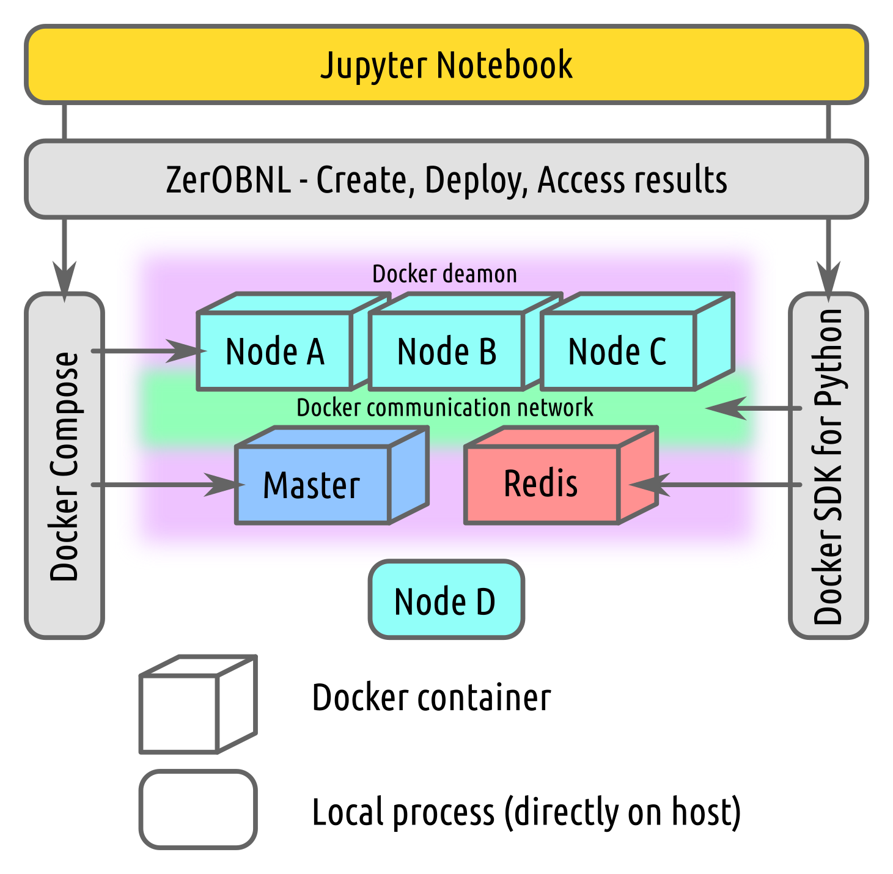
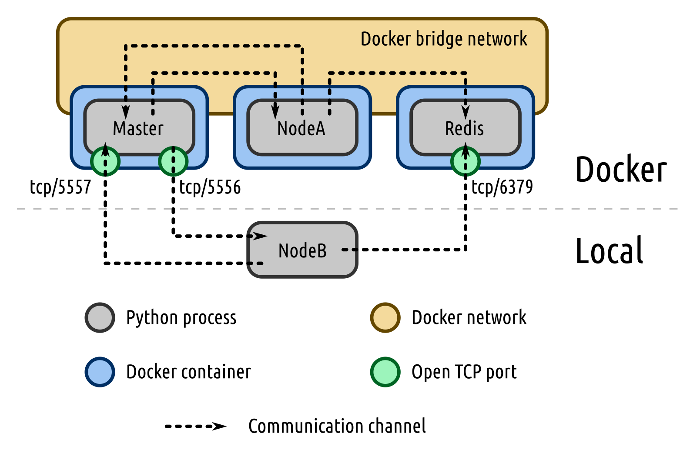
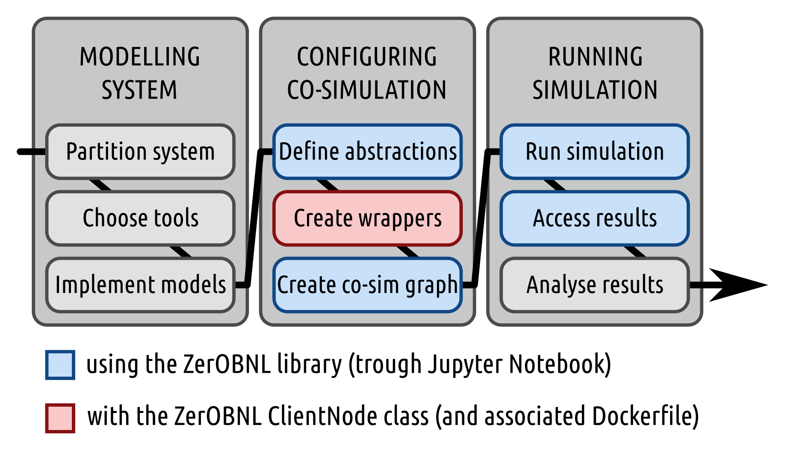
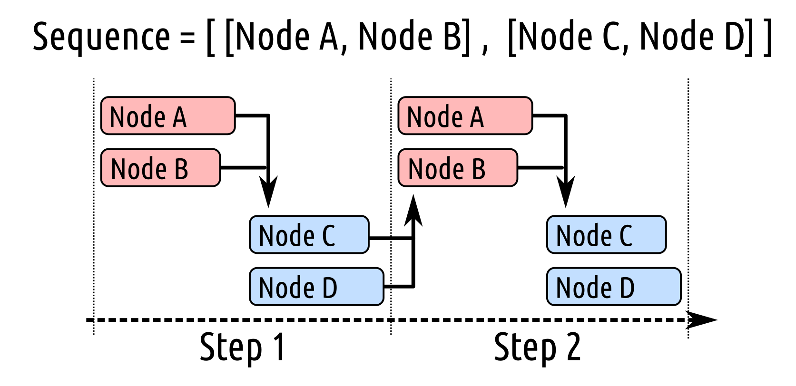

# Documentation

## What is co-simulation ?

Co-simulation can be defined as the coupling of simulation tools (also referred to as simulators) for assessing a partitioned complex system. The idea is to partition a system into sub-systems, modelling each of them separately with a specific simulator and to re-create the global behaviour of the complete system by exchanging data between the models of the sub-systems at simulation runtime. Within this context, a co-simulation tool or platform is the software synchronizing execution and data exchange of the individual simulators coupled within a co-simulation. The platform can also help to create co-simulation models and to deploy simulators.

## ZerOBNL features

#### What ZerOBNL can do:
- Distributed simulation (on a real cluster or just connecting two computers)
- Cross-platform simulation (Linux, Windows and/or MacOS in the same simulation)
- Simplified deployment process (based on Docker containers)

#### What ZerOBNL can not do:
- Coffee
- Modelling sub-systems
- Database (see our [article](https://www.researchgate.net/publication/327754115_FIRST_STEPS_TOWARDS_LINKING_SEMANTIC_3D_CITY_MODELLING_AND_MULTI-DOMAIN_CO-SIMULATION_FOR_ENERGY_MODELLING_AT_URBAN_SCALE?_iepl%5BviewId%5D=nYBAo5z65FFelGu9sKV1UGEe&_iepl%5Bcontexts%5D%5B0%5D=projectUpdatesLog&_iepl%5BtargetEntityId%5D=PB%3A327754115&_iepl%5BinteractionType%5D=publicationTitle) for that)

## How does ZerOBNL works ?



We recommend to use [Jupyter Notebook](http://jupyter.org/) to interact with ZerOBNL. 

Jupyter is a web-application for interactive computing. It allows to combine live code, visualisations (images, diagrams and results) and narrative text. Such features make it a valuable trade-off between graphical and pure code based interface bringing together the ease of use and the high versatility of a programming language. This application enable the creation of rich and interactive outputs and easily shareable notebooks (and display via GitHub/GitLab). 

Jupyter is fully free and open source, heavily modular and customizable, and based on open standards. It provides a simplified access to the general purpose and well documented Python (and other various programming languages) ecosystem for data mining and management, plotting, etc. 

Such features make Jupyter a good choice to define co-simulation and analyse results in the same environment of development.

ZerOBNL relies on [Docker](https://www.docker.com/) to create dedicated and isolated [containers](https://www.docker.com/resources/what-container) that packages up code and dependencies for each model of sub-systems and allows to run it quickly and reliably from one computing environment to another. Docker provide a simple to allow communication between containers by creating [networks](https://docs.docker.com/network/).

The simulation is orchestrated by a *Master* process (also running inside a Docker container). The communication between the *Master* process and models is done using [ZeroMQ](http://zguide.zeromq.org/), following a communication process described below.

> ZeroMQ looks like an embeddable networking library but acts like a concurrency framework. It gives you sockets that carry atomic messages across various transports like in-process, inter-process, TCP, and multicast.

During the simulation, exchanged data and models internal state are stored into a results database. This database is hosted on a [Redis](https://redis.io/) container. 

> Redis is an open source (BSD licensed), in-memory data structure store, used as a database, cache and message broker.


The communication between the *Master* and the *Nodes* goes through two different [channels](http://zguide.zeromq.org/page:all). The *Master* can publish messages and broadcast it to a group or to all the *Nodes* via a publish/subscribe pattern. The *Nodes* can then respond to the message by sending a response message to a first-in-first-out queue via a push/pull pattern. The *Master* knows how much *Nodes* needs to respond so as soon as every needed *Node* send back a message it can start the next simulation process.    



It is also possible to run *Nodes* directly on the host, without using Docker. In order to allow that, two ports are made accessible for the *Master*: 5556 and 5557 by default, corresponding respectively to the publish/subscribe and the push/pull communication patterns. The default port for Redis (6379) is also open so a *Node* running locally can send values to the results database, see [minimal local example](https://github.com/IntegrCiTy/zerobnl/blob/master/examples/MinimalExample/MinimalExampleLocal.ipynb).

## How to model complex systems with ZerOBNL ?



#### 1. Partition system

This is the core part of large scale multi-domain co-simulation, defining how you will cut your large system into smaller one and how the information will flow between the sub-systems.
Examples: 
- do you put a heat pump and its associated controller in the same sub-system or in two different one ?
- do you want to transfer mass flow [kg/s] and temperature [°C] or only a thermal power [kW] ?
- what is the more adapted communication step size between the sub-systems ?

#### 2. Choose simulation tools

In order to be used in a co-simulation a simulation tool must be able to communicate with an external process, so it is possible to get a value, set a value and make a simulation step.

Some standards already exists like [Functional Mock-up Interface](https://fmi-standard.org/) to facilitate data exchanged between models.

> Functional Mock-up Interface (FMI) is a tool independent standard to support both model exchange and co-simulation of dynamic models using a combination of xml-files and compiled C-code.

#### 3. Implement models

ZerOBNL only help to connect tool together, it's your job create needed models for your simulation. They need to allow for 3 features:

1. set attribute
2. get attribute
3. make a step (fixed or variable time step)

#### 4. Create wrappers

[Wrappers](#Wrapper) are the key point between simulation tools and the rest of the co-simulation framework. Using the ZerOBNL ClientNode python class, this process will, during the simulation, be used as middle agent between the orchestration process and the simulation model, passing messages and data back and forth.

You can use the wrapper of the provided [minimal example](https://github.com/IntegrCiTy/zerobnl/blob/master/examples/MinimalExample/wrapper_base.py) as template and build your own wrappers from there.

#### 5. Define abstractions

This is when you need to define the conceptual co-simulation model by creating *Meta-models*, *Environments* and *Nodes*.

A *Meta-model* defines the inputs and the outputs, more precisely attributes to set to the model and attributes to get from the model. It describes the way the model of a sub-system will interact with other models of other sub-systems. In order to maintain consistency between exchanged data, you also need to define the unit of the attribute, so you do note connect [kW] to [m3/s]. 

On the following example the *Meta-Model* `Meta` has an input `a` defined as a binary and two outputs `b` and `c` defined respectively as [m3/s] and [kW]. 

```python
from zerobnl import CoSim
sim = CoSim()
sim.create_meta_model("Meta", [("a", "binary")], [("b", "m3/s"), ("c", "kW")])
```

An *Environment* characterize the simulation settings needed by a model to run. It defines the dependencies (see [Dockerfile](#Dockerfile)) of the simulation tool, how the model will communicate with the orchestration process (see [Wrapper](#Wrapper)) 

```python
from zerobnl import CoSim
sim = CoSim()
sim.create_environment("Env", "wrappers/my_wrapper.py", "dockerfiles/MyDockerfile")
```

A *Node* is a running instance of a model of a sub-system. You can define:
- **initial values**, that will be set to attributes of the model
- **parameters**, that can be used by the wrapper
- **files**, to add to the dedicated container
- and define if the *Node* will run locally or in a container, by setting **local** to true.

```python
sim.add_node("Node", "Meta", "Env", init_values={"d": 0.5}, parameters={"data_file": "mydata.csv"}, files=["data/mydata.csv"], local=True)
```

#### 6. Create [co-simulation graph](#CoSimGraph)

The co-simulation models and results are closely related on how you decide to partition your system. This is where you actually connect the sub-systems together and define the exchanged data using *Links*.

The following example connects the output attribute `sink_flow` of `NodeA` to the input attribute `srce_flow` of `NodeB`.

```python
sim.add_link("NodeA", "sink_flow", "NodeB", "srce_flow")
```

#### 7. Run simulation

- Define simulation sequence



The following example define two groups of *Nodes* to be run sequentially as shown above. `NodeA` and `NodeB` will make a step in parallel, and when both are done `NodeC` and `NodeD`  will also make a step in parallel.

```python
sim.create_sequence([["NodeA", "NodeB"], ["NodeC", "NodeD"]])
```

*Nodes* sharing a direct *Link* can not be in the same group and run in parallel.

- Create simulation steps

```python
sim.set_time_unit("minutes")
sim.create_steps([10]*60*5)  # This will create 5*60=300 steps of 10 defined time unit (minutes)
```

Once everything is ready, you need then to run the simulation and go take a coffee, depending on how you defined your sub-systems, the number of them, the communication step size you choose and the available computation power, it can takes some time !

#### 8. Access results

During simulation results and variables of the different sub-systems are stored into a Redis database, the ZerOBNL API give you some methods to collect and export them.

```python
sim.connect_to_results_db()
sim.get_list_of_available_results()
res = sim.get_results_by_pattern("OUT*Base0*")
```

#### 9. Analyse results

Well, do whatever you want or need to do with the results...
Since you are working with Python you can directly use [matplotlib](https://matplotlib.org/) and/or [seaborn](https://seaborn.pydata.org/) to visualise results and [Pandas](https://pandas.pydata.org/) to post-process and export it. 

## Glossary

- <a name="Dockerfile"></a> **Dockerfile**: 

Docker can build images automatically by reading the instructions from a Dockerfile. A Dockerfile is a text document that contains all the commands a user could call on the command line to assemble an image. You can refer to the Dockerfile [best practices](https://docs.docker.com/develop/develop-images/dockerfile_best-practices/) for a tip-oriented guide and use this [file](https://github.com/IntegrCiTy/zerobnl/blob/master/Dockerfiles/Dockerfile) as template.

- <a name="Wrapper"></a> **Wrapper**:

TODO: def. Wrapper

- <a name="CoSimGraph"></a> **Co-Simulation Graph**:

TODO: def. Co-Simulation Graph

TODO: add example image

[Home](./index.md)