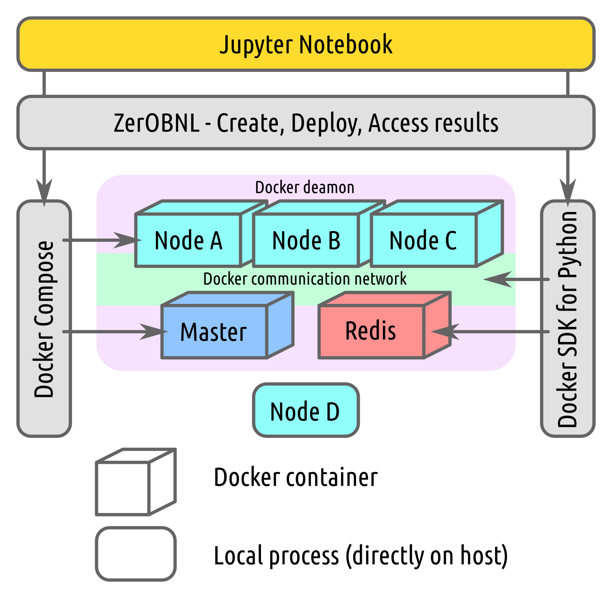
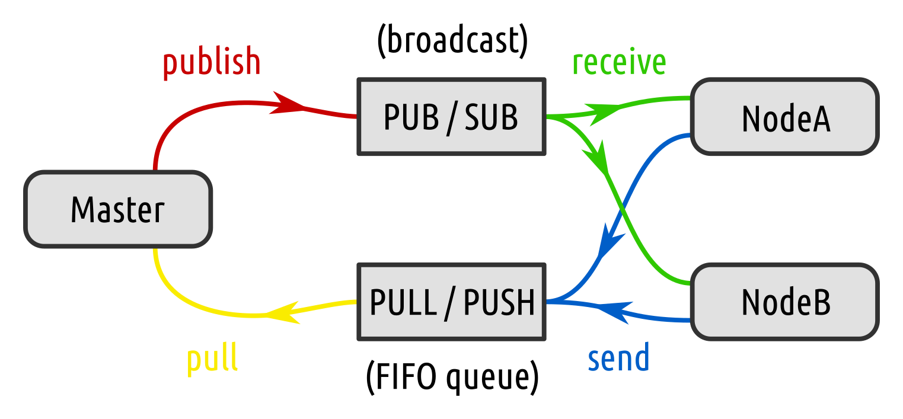

# Documentation

## What is co-simulation ?

Co-simulation can be defined as the coupling of simulation tools (also referred to as simulators) for assessing a partitioned complex system. The idea is to partition a system into sub-systems, modelling each of them separately with a specific simulator and to re-create the global behaviour of the complete system by exchanging data between the models of the sub-systems at simulation runtime. Within this context, a co-simulation tool or platform is the software synchronizing execution and data exchange of the individual simulators coupled within a co-simulation. The platform can also help to create co-simulation models and to deploy simulators.

## ZerOBNL features

#### What ZerOBNL can do:
- Distributed simulation (on a real cluster or just connecting two computers)
- Cross-platform simulation (Linux, Windows and/or MacOS in the same simulation)
- Simplified deployment process

#### What ZerOBNL can not do:
- Coffee
- Modelling sub-systems
- Database (see our [article](https://www.researchgate.net/publication/327754115_FIRST_STEPS_TOWARDS_LINKING_SEMANTIC_3D_CITY_MODELLING_AND_MULTI-DOMAIN_CO-SIMULATION_FOR_ENERGY_MODELLING_AT_URBAN_SCALE?_iepl%5BviewId%5D=nYBAo5z65FFelGu9sKV1UGEe&_iepl%5Bcontexts%5D%5B0%5D=projectUpdatesLog&_iepl%5BtargetEntityId%5D=PB%3A327754115&_iepl%5BinteractionType%5D=publicationTitle) for that)

## How does ZerOBNL works ?





The communication between 


## How to model complex systems with ZerOBNL ?


#### 1. Partition system

This is the core part of large scale multi-domain co-simulation, defining how you will cut your large system into smaller one and how the information will flow between the sub-systems.
Examples: 
- do you put a heat pump and its associated controller in the same sub-system or in two different one ?
- do you want to transfer mass flow [kg/s] and temperature [°C] or only a thermal power [kW] ?
- what is the optimal communication step size between the sub-systems ?

#### 2. Choose simulation tools

#### 3. Implement models

ZerOBNL only help to connect tool together, it's your job create needed models for your simulation. They need to allow for 3 features:

1. set attribute
2. get attribute
3. make a step (fixed or variable time step)

#### 4. Create wrappers

Wrappers are the key point between simulation tools and the rest of the co-simulation framework. Using the ZerOBNL ClientNode python class, this process will, during the simulation, be used as middle agent between the orchestration process and the simulation model, passing messages and data back and forth.

#### 5. Define abstractions

This is when you need to define the conceptual co-simulation model by creating *Meta-models*, *Environments* and *Nodes*.

A *Meta-model* defines the inputs and the outputs, more precisely attributes to set to the model and attributes to get from the model. It describes the way the model of a sub-system will interact with other models of other sub-systems.

```python
from zerobnl import CoSim
sim = CoSim()
sim.create_meta_model("Meta", [("a", "binary")], [("b", "m3/s"), ("c", "kW")])
```

An *Environment* characterize the simulation settings needed by a model to run. It defines the dependencies (see [Dockerfile](#Dockerfile)) of the simulation tool, how the model will communicate with the orchestration process (see [Wrapper](#Wrapper)) 

```python
from zerobnl import CoSim
sim = CoSim()
sim.create_environment("Env", "wrappers/my_wrapper.py", "dockerfiles/MyDockerfile")
```

A *Node*

```python
sim.add_node("Node", "Meta", "Env", init_values={"d": 0.5}, parameters={"data_file": "mydata.csv"}, files=["data/mydata.csv"], local=True)
```

#### 6. Create co-simulation graph

The co-simulation models and results are closely related on how you decide to partition your system. This is where you actually connect the sub-systems together and define the exchanged data using *Links*.

```python
sim.add_link("NodeA", "sink_flow", "NodeB", "srce_flow")
```

#### 7. Run simulation

1. Define simulation sequence


```python
sim.create_sequence([["NodeA", "NodeB"], ["NodeC", "NodeD"]])
```

2. Create simulation steps

```python
sim.set_time_unit("minutes")
sim.create_steps([10]*60*5)  # This will create 5*60=300 steps of 10 defined time unit (minutes)
```

Once everything is ready, you need then to run the simulation and go take a coffee, depending on how you defined your sub-systems, the number of them, the communication step size you choose and the available computation power, it can takes some time !

#### 8. Access results

During simulation results and variables of the different sub-systems are stored into a Redis database, the ZerOBNL API give you some methods to collect and export them.

#### 9. Analyse results

Well, do whatever you want or need to do with the results...

## Glossary

- <a name="Dockerfile"></a> **Dockerfile**: 

Docker can build images automatically by reading the instructions from a Dockerfile. A Dockerfile is a text document that contains all the commands a user could call on the command line to assemble an image. You can refer to the Dockerfile [best practices](https://docs.docker.com/develop/develop-images/dockerfile_best-practices/) for a tip-oriented guide and use this [file](https://github.com/IntegrCiTy/zerobnl/blob/master/Dockerfiles/Dockerfile) as example.

- <a name="Wrapper"></a> **Wrapper**:

TODO: def. Wrapper

- <a name="CoSimGraph"></a> **Co-Simulation Graph**:

TODO: def. Co-Simulation Graph

[Home](./index.md)